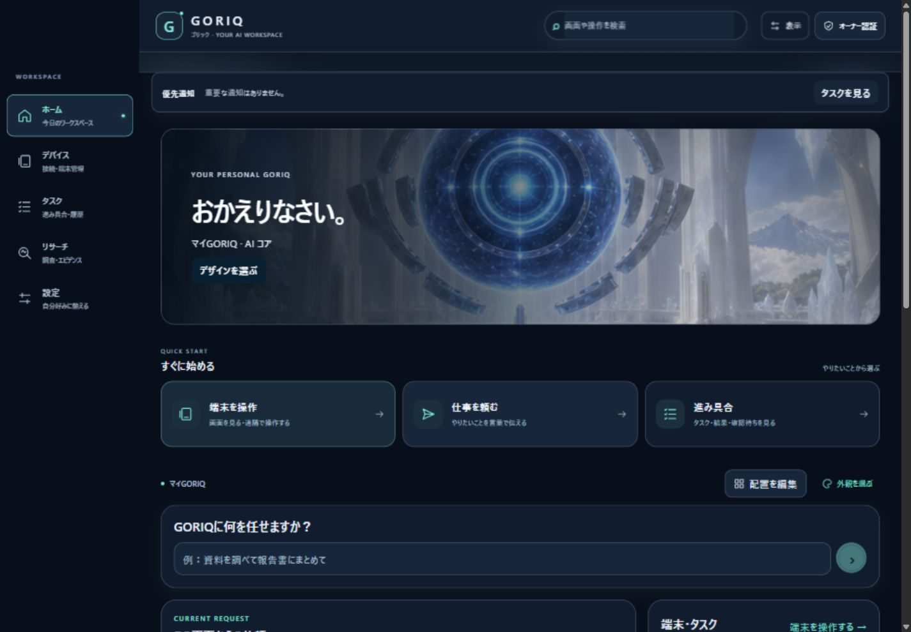
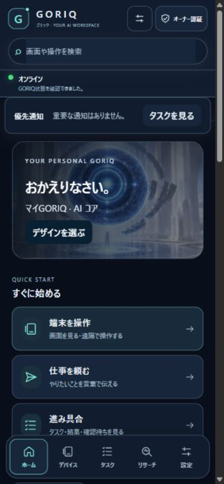

# GORIQ appearance and workspace — #1214

Parent #681 P5. Source main54b5df2a41eaef75e7c40a83474aceb8fc15b3be; candidate branch codex/1214-personal-ui. Not deployed. Exact code revision and CI are recorded below after commit.

## Owner scope and implementation

The accepted owner instruction in issue1214 requests20 selectable visual styles plus default menus/panels that people can rearrange and add. owner-1214-personal-ui binds that exact instruction to17 existing UI requirements. Frozen340 IDs are preserved; no requirement is declared physically verified.

- Twenty local illustrated concepts with distinct palettes and geometry: clean, space, adult anime/portrait companions, hologram/core, butler/team, labs, bridge/cockpit/AR, cyber/nature/gold, twin/adaptive. Images are decorative; they do not claim actual AR/agents/digital-twin capabilities. See public/jarvis/concepts/README.md for provenance/hashes.
- Settings → named browser-local display profiles (up to12). Each retains design, navigation order/edge, home panel order/width and a note. No account/cross-device synchronization claim. Earlier preference keys, persona, voice and accent remain stored separately. New artwork palettes are used while the new appearance layer is active; legacy theme/accent styling is restored by the explicit legacy toggle. UI-010 is not promoted.
- Defaults: request, current request status, actual Broker statistics, requirements. Clock, note and fixed shortcuts can be added. Three responsive widths, hide/show, arrow/keyboard movement, native HTML5 drag, undo/redo/reset. One instance per panel kind prevents duplicated command controls. Settings and critical notifications remain outside hideable panels.
- Main navigation keeps all5 fixed routes. Four desktop edges, bottom adaptation for mobile. Removed the unrelated app-level dashboard/chat overlay on JARVIS routes; its original behavior remains on other routes. Common display/operation controls are in a disclosure outside the read-only boundary. Empty notifications are compact; actual alerts keep full content.
- Storage failures are visible; invalid data and IDs are normalized without stealing another valid profile identity. Arbitrary scripts/HTML/URLs/widgets are rejected. Read-only/kiosk capture also blocks drag/drop. Protected auth, device and work API contracts are unchanged.

## Earlier twenty-concept verification (61f3dc5)

Machine-readable result: [1214-ui-checks.json](1214-ui-checks.json).

|Check|Result|
|---|---|
|Full node tests|1485 PASS /0 fail /0 skipped|
|P8 security suite|331 PASS /0 fail /0 skipped|
|New store/catalog tests|22 PASS; bounded normalization/history, isolated profiles, storage recovery, ID repair, contrast>=4.5:1, fixed artwork manifests|
|Lint / normal Next Turbopack build|PASS including TypeScript|
|Canonical/mirror/reverse audit|340 requirements /488 surfaces PASS; required evidence classes preserved|
|Browser:20 themes, profiles/reload,4 nav edges|PASS|
|Browser: panel addition, hide, arrow/keyboard move,3 widths, undo/redo/reset, note reload|PASS|
|Browser:5 routes,390px phone/1440px desktop, no horizontal overflow, focus outline, high contrast, reduced motion, readonly arrow blocking|PASS; no console errors in inspected session|
|Native HTML5 drag via CUA|INCONCLUSIVE: three bounded synthetic/native tool drags left order unchanged; arrow movement passed. Do not label direct-drag acceptance PASS.|
|Actual iPhone/Android /owner approval /Production|Pending; viewport testing is not physical evidence|

The isolated host uses loopback-only random ports, independent empty SQLite and synthetic auth, with real Worker adapter and external publication disabled. Screens show its true zero-device state. Owner's live registry/enrollment/credentials were not used or changed. The preview is bounded and expires automatically.

Environment findings: initial shared node_modules junction was rejected by Turbopack. A Webpack diagnostic build reported pre-existing route-export typing incompatibilities; no route checks were changed. Installing from the existing offline pnpm cache allowed the repository's normal Turbopack build to pass. The first full test run lacked bash in PATH; adding installed Git Bash to that command's PATH made all1485 pass without changing tests. Untracked QA harness imports were corrected for lint. Existing dynamic filesystem tracing warning in video-plan-store remains outside this UI scope.

## Review and rollback

Independent review found and fixed save-error masking, repaired-ID collisions, legacy storage exceptions and read-only drag interception. Code/storage tests and browser evidence are separate. Last verified commit will reference the code candidate, not infer PHYSICAL evidence.

Revert this branch's UI integration and dependent canonical mapping together. Keep the local profile key inert; no deletion/re-enrollment/reset of devices is needed. No Production deployment, secrets/permissions, paid service, DB migration or unrelated physical-PR hold is changed. Production review and owner visual/drag acceptance remain before activation.

## Previous candidate

Code commit: 61f3dc57387c5efc5988dbf0ab933d877698d1e3. Draft PR: https://github.com/haji84/AI-/pull/1215. Final evidence/state-only follow-up changes no runtime behavior. Candidate audit stores this software revision; last_verified_commit remains null because the full physical requirement is not verified. CI result is recorded on the exact PR head in GitHub and Compass.

## GORIQ owner correction — 2026-09-23

Exact code commit: df2f39b902191b8561fff59ecb2582d1bfa92889. Existing Issue #1214 / draft PR #1215. Owner decision owner-1214-goriq-menu retains the original20-concept request and binds the newer name/menu correction. No new requirement IDs or physical completion claims.

- Web branding, app metadata, PWA display name, icons and UI copy become GORIQ（ゴリック）. Existing URL paths, local preference keys, Worker app IDs, APK/signing, device identities/enrollment and authorization contracts remain unchanged. Installed native Worker labels are not updated by this Web PR.
- Icon/label/description desktop navigation and icon/label mobile dock. Existing four-edge placement and local profiles remain available.
- Home quick actions open the existing remote console, focus/restore the request panel, or navigate to task progress. Clicking an entry does not start a remote session or submit a job.
- Always-visible search supports Ctrl/Cmd+K, result navigation, outside tap, focus leave and a visible close button. Display controls remain outside the read-only boundary; mobile stacking keeps them usable.
- Default profile name migrates from マイJARVIS to マイGORIQ without a false corruption warning. Custom names, IDs, notes, layout and true damaged-data warnings are preserved.

### Current verification

Full tests1487/P8 security331: PASS, zero failures/skips. Lint, normal Turbopack build (including TypeScript),340-requirement/491-surface audit: PASS. Existing video-plan-store tracing warning remains.

Desktop1440 and mobile390 browser: direct remote open/close/reopen; request focus and hidden panel restoration; task navigation; search shortcut/results; touch dismissal; display-menu stacking; read-only blocking; five routes; four navigation edges; light/dark palettes; no horizontal overflow. All PASS. Mobile navigation targets62px high and approximately66.7px wide. Inspected browser error log:0. Viewport reset after testing. This is isolated software/browser evidence, not phone/Worker physical acceptance.

Independent review found three P2 issues (repeat remote link, mobile search dismissal, mobile menu stacking), all fixed and re-reviewed. Source tests changed only for new display strings and exact structured navigation/render bindings; protection assertions retained. Runtime code was not changed after the passing build and browser checks.

Native HTML5 drag remains INCONCLUSIVE from the earlier three-attempt acceptance; arrows/keyboard remain supported. Production, main, physical-facing PR holds, device registration, credentials and private networking are unchanged. Rollback: revert UI/code and its ledger mapping together; no device reset or re-enrollment. Next: exact-head CI, owner visual/drag acceptance, then separately governed activation.
